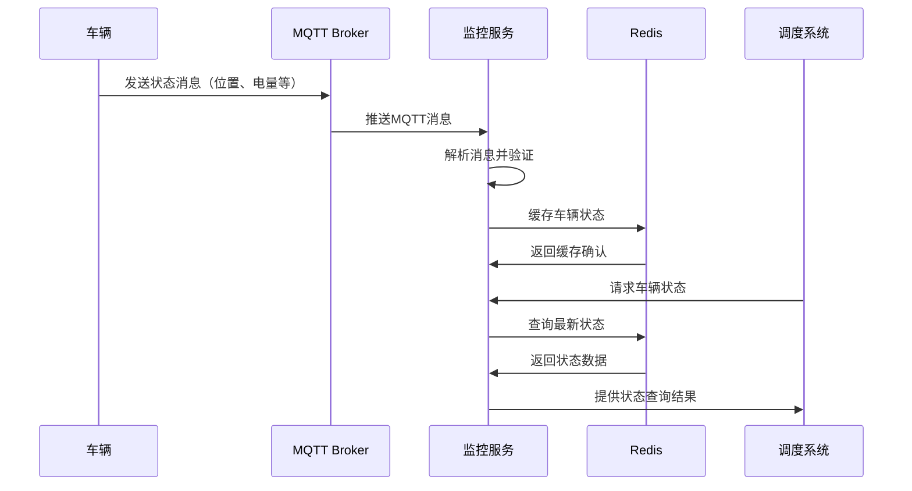
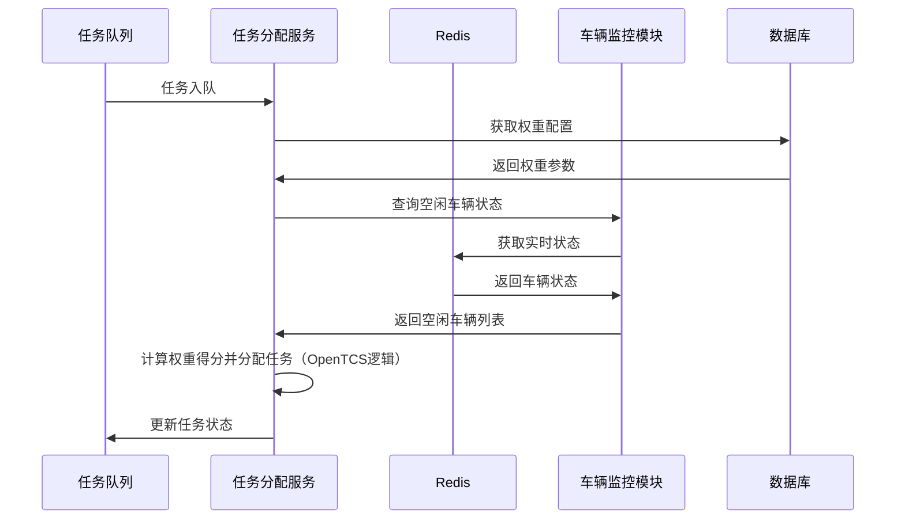
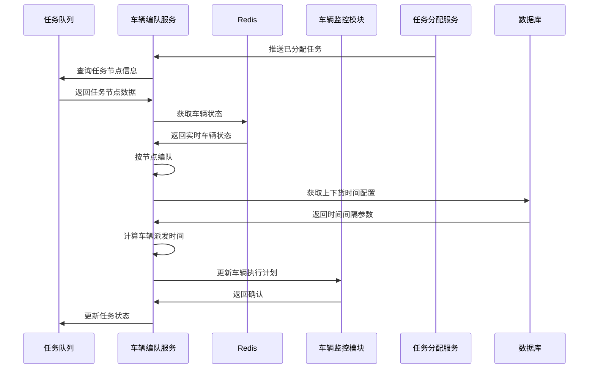
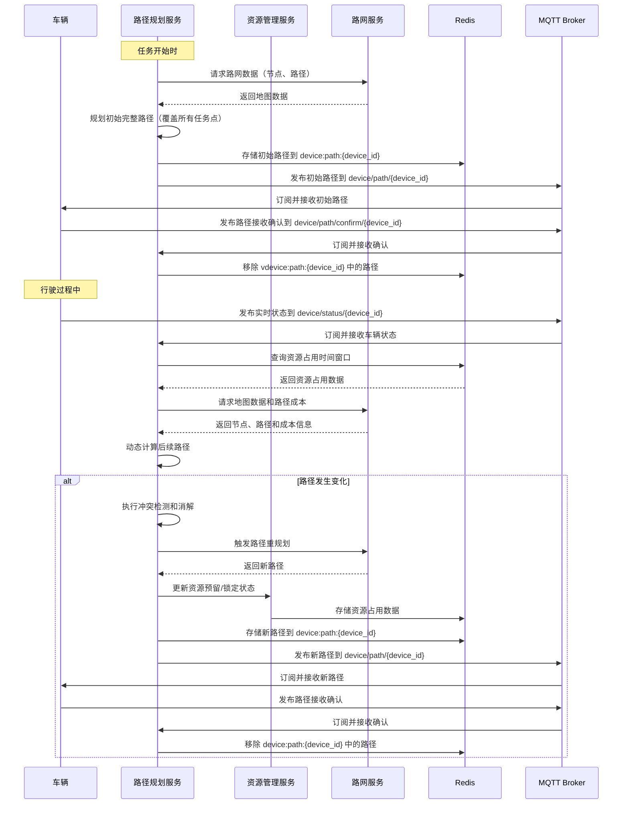

## 项目目标
本项目旨在为多台无人车的自动化作业环境设计并实现一个全局调度系统。核心目标是通过智能调度算法和精细化的资源管理，最大化提升整体作业效率，确保车辆运行流畅，避免碰撞、顶流和拥堵。

## 模块划分

### 车辆监控模块
通过订阅MQTT主题消息，实时监控车辆的状态。维护机器人的静态信息和动态实时状态（位置、电量、速度、故障等）。

属性和状态缓存到Redis，向调度服务提供机器人信息。



### 任务分配模块

所有待执行的任务会进入到任务队列，按任务的待执行权重进行排序，最终由系统来派发。进入队列的任务并不会马上执行，而是有专门的线程去计算执行任务的机器人和时间，会根据该任务的类型选择合适的机器人并计算所需要的资源（路段），预测其开始执行的时间。如果到执行时间发现资源还是被占用再进行下一轮计算。

#### 机器人选择

  1. 筛选状态为“空闲”且电量满足基本任务需求的机器人。

  2. 根据权重函数计算候选机器人到任务起点的“预估行驶成本”。

  3. 选择成本最小的机器人。

应用机器人选择权重函数：对通过初步筛选的机器人，使用加权评分函数计算其对当前任务的“适应度得分”。

```
`score_robot` = (`w_dist` * `normScore_distance`) + (`w_battery` * `normScore_battery`) + (`w_mileage` * `normScore_mileage`) + (`w_idle_time` * `normScore_idle_time`)
各项权重` w_`  从 `system_config` 表中读取，可配置，各项归一化得分 `normScore_`  范围建议为 [0, 1]。
1. `normScore_distance`(距离得分):
	1. 任务起点坐标 (Px, Py) 从 任务中获取。
    2. 使用Redis GEO查询指定范围内（如500米）最近的N个机器人及其距离。
    3. `normScore_distance` = 1 - (`distance_to_task` / `search_radius_m`)。距离越近，得分越高。
2. `normScore_battery` (电量得分):
    `normScore_battery` = (`current_battery_level` - `min_required_battery_for_task`) / (`max_battery_level` - `min_required_battery_for_task`)。电量越充裕（且满足任务基本需求），得分越高。
3. `normScore_mileage` (累计里程得分)
`normScore_mileage` = 1 - (`current_mileage` / `max_expected_mileage`)。里程越低，得分越高。可设置一个“期望最大里程”，超过则得分较低。
4. `normScore_idle_time` (空闲时长得分)
    `normScore_idle_time` = (`current_idle_duration` / `max_expected_idle_duration`)。空闲时间越长，得分越高，优先调度长时间未工作的机器人。
```



###   车辆自动编队      

执行同一节点或者任务的车辆进行编队，依据任务点执行的时间间隔（例如上下货时间）进行车辆的派发，保证车辆有序有节奏的执行



### 路径规划模块	

#### 路网管理
  管理和提供路网的拓扑结构（路点、路径段、工作站、充电点），包括路径段属性（车道长度、车道宽度、车道方向、车道转向、车道数、车道限速、是否允许变道、`f(n)`动态成本因子等）。提供路网数据给调度服务，路网数据可缓存到Redis以提高访问速度。`f(n)`因子可存储在Redis中并动态更新。

- 路网数据导入
	基于路网编辑器中map.json数据解析存储
	
	
- 构造路网模型
	
- 根据起点终点查询可选路径
1. 根据起点和终点查询路网拓扑结构 ，获取从 A 到 B 的所有可能路径段
2. 对这些路径段应用成本因子（cost_factor） ，进行加权计算
3. 最终选出一条最优路径 （如最短/最低成本路径）

#### 静态路径规划

为机器人执行任务规划最优行驶路径。

调度算法：遍历路段选择最优路径。成本函数 `f(n)=α⋅genergy​(n)+β⋅gtime​(n)+ gobs​(n)` 

相关算法：

- Dijkstra算法
- A星算法
- Floyd算法	

```
 `α`, `β`: 可配置的权重系数。
 `genergy(n)`: `路段长度 * 单位距离耗电量` (单位距离耗电量可设为AGV的平均值或根据车型配置)。
 `gtime(n)`: `路段长度 / 路段允许最大速度` (速度根据路段是直道还是弯道，以及OpenTCS中配置的最大速度确定)。
 `gobs(n)`: 初始为0。当路径段遇到障碍或拥堵时，其值更新为 `(α⋅genergy(n)+β⋅gtime(n)) * 2`。 障碍或拥堵解除后恢复为0。此值的更新会触发相关路径的重新评估或规划。
```

#### 动态路径规划

  基于当前所有已分配任务的路径规划结果、机器人实时状态，预测未来一段时间内各个机器人对共享资源（路径段、交叉口、工作站入口）的占用时间窗口。通过这种预测，提前识别潜在冲突并进行主动协调。

##### 预测方法
1. 时空轨迹预测: 对每个机器人，沿着其规划路径，逐段计算预计到达和离开每个关键资源点（如路径段入口/出口、交叉口内的所有节点）的时间 (ETA/ETD)。
2. 资源占用窗口生成: 为每个机器人计划占用的每个资源，生成一个预测的占用时间窗口：[预计进入时间 - 前置安全缓冲, 预计离开时间 + 后置安全缓冲]。缓冲时间用于吸收一定的执行不确定性。
3. 冲突预测与检测: 在一个共享的“资源-时间”视图中（例如，存储在Redis中的数据结构），检测不同机器人的预测资源占用窗口在时间和空间上的重叠。
resource_id -> sorted_list_of [(robot_id, predicted_entry_time, predicted_exit_time, priority, status), ...]

##### 协调策略
1. 时间协调: 轻微延迟出发，让优先级较低或后规划的机器人在其起始点或某个安全的中间等待点（非关键路径）稍作等待，以错开与高优先级机器人在冲突点的相遇时间。
2. 速度协调: 建议机器人在非瓶颈路段提前减速或适当加速（在安全和能耗允许范围内），以调整其到达冲突点的时间。
3. 空间协调: 动态路径微调/重规划， 如果预测到严重或无法通过时间调整解决的冲突，提前为优先级较低或更具灵活性的机器人重新规划路径，选择避开预测拥堵区域的替代路线。
4. 优先级管理: 基于任务的紧急程度、机器人当前电量、已等待时间、任务链的重要性等因素，动态调整机器人在特定冲突点的通行优先级。
系统应能处理优先级反转问题（例如，通过优先级继承）。
5. 资源预留与锁定: 一旦冲突消解策略确定，系统会为机器人“预留”其在未来一段时间内将要使用的资源。当机器人即将实际进入该资源时，预留状态会转为“锁定/占用”。

##### 交互流程
开始执行任务时规划一个完整的路线，即经过所有任务点的完整路径，在行驶过程中根据当前路段动态计算后续行驶路径，如果有变化则下发最新行驶路径。


##### Redis 缓存设计
使用Redis Sorted Set ，每个元素关联一个分数（score）。设计如下：
- key：resource:{map_name}:{resource_id}，表示特定地图中的某个资源（如路径段或节点）。
- value：存储资源占用记录，格式为 JSON 对象，包含 (vehicle_id, entry_time, exit_time, priority, status)。
- score：使用 entry_time（预计进入时间）作为分数，便于按时间排序和查询。用途：通过查询时间窗口的重叠，判断资源是否被占用。

##### 判断资源占用的逻辑
存储资源占用时间窗口：每当为车辆规划路径时，计算每个资源（路径段、节点）的预计占用时间窗口 [entry_time - buffer, exit_time + buffer]，buffer（默认 2 秒）用于吸收执行偏差。
将时间窗口存储到 Redis Sorted Set，key 为 resource:{map_name}:{resource_id}，score 为entry_time，value 为占用记录的 JSON 字符串。
- 查询资源占用：使用 ZRANGEBYSCORE 命令查询指定时间范围内的占用记录。若查询结果不为空，且时间窗口与目标时间段重叠，则资源被占用。
- 判断时间窗口重叠：对于资源占用记录 (entry_time1, exit_time1) 和目标时间窗口 (entry_time2, exit_time2)，如果满足以下条件之一，则存在重叠：entry_time1 <= exit_time2 且 exit_time1 >= entry_time2重叠表示资源在该时间段内被占用。
- 资源占用状态：如果查询到重叠的占用记录，且记录的 status 为 RESERVED 或 LOCKED，则资源被占用。如果没有重叠记录，或记录的 status 为 RELEASED，则资源未被占用。

### 交通管理模块
#### 资源监控
实时监控路段信息，包括路段上的所有车辆和位置（离路段的起始位置）、是否有障碍、通过该路段的时长

#### 路口控制
利用Redis的分布式锁来实现对路径段的锁定和释放。在Redis中维护一个动态的、精细化的未来资源占用时间轴。记录每个关键资源（路径段、交叉口内的节点）在未来一段时间内被哪个机器人、在哪个预测时间窗口内占用或预留。


## 路网数据设计

以`GeoJSON`数据格式传输、存储地理信息及相关属性信息

```JSON
{
    "type":"FeatureCollection",
    "features":[
        {
            "type":"Feature",
            "properties":{},
            "geometry":{}
        },
        {
            "type":"Feature",
            "properties":{},
            "geometry":{}
        },
        {
            "type":"Feature",
            "properties":{},
            "geometry":{}
        }
    ]
}
```

GeoJSON中的所有地理要素统称为feature，features数组中的每一个元素就是一个feature对象，feature对象的geometry对象存储了该feature的地理信息(坐标)和类型信息(如点、线段、弧线、区域)；properties对象存储了对应feature的属性信息。


## 表结构设计
###  vehicle_static_info (车辆静态信息表)

| 字段            | 名称         | 类型           | 说明       |
|----------------|-----------|--------------|----------------|
| id           | 主键        | BIGINT       | 自增主键|
| device_id    | 设备id  | VARCHAR(50)  | 设备唯一业务标识，UNIQUE  |
| device_type    | 设备类型  | VARCHAR(50)  | 设备类型:1-牵引车，2-平板车，3-叉车，4-道闸，5-红绿灯  |
| specification  | 车辆型号      | VARCHAR(100) |                   |
| max_speed            | 最大速度     | INT          | 车辆最大速度   |
| lateral_acceleration | 横向加速度   | INT          | 车辆加速度    |
| max_payload           | 最大载重(kg)   | INT         |      |
| battery_capacity      | 电池容量(Wh瓦时) | INT        |      |

### vehicle_dynamic_info (车辆动态信息表)

| 字段     | 名称       | 类型          | 说明     |
|---------|------------|-------------|------------------|
| id | 车辆ID | BIGINT      | vehicle_static_info.id, 主键 |
| location_x |当前X坐标| DOUBLE   | 实时位置                     |
| location_y    | 当前Y坐标  | DOUBLE    | 实时位置       |
| point_id      | 当前/最近路点ID  | BIGINT      | 关联vehicle_plant_point.id   |
| speed | 当前速度       | INT         |         |
| energy_percent  | 当前电量百分比    | TINYINT     | 0-100      |
| total_mileage | 累计行驶里程(米)  | DOUBLE |             |
| status                   | 车辆状态      | VARCHAR(30) | IDLE, BUSY, CHARGING, MAINTENANCE |
| task_id         | 当前任务ID     | BIGINT      | 关联任务ID   |
| last_heartbeat_ts        | 最后心跳时间     | TIMESTAMP   |         |
| update_time              | 更新时间     | TIMESTAMP   |           |


### vehicle_task_dispatch (车辆任务调度表)

| 字段         | 名称      | 类型          | 说明           |
|------------|---------|-------------|--------------|
| id         | 主键      | BIGINT      | 自增主键         |
| map_name | 地图名称 | BIGINT | 关联的地图 |
| task_id    | 任务ID   | BIGINT      | 关联任务id              |
| vehicle_id   | 车辆ID | BIGINT      | 关联vehicles_static.id    |
| map_name | 地图名称 | VARCHAR(50) | 使用的地图名称 |
| start_point_id   | 起始点ID | BIGINT      | 当前位置或起始路点    |
| target_point_id   | 目标点ID| BIGINT      | 需要到达的终点路点   |
| task_type | 任务类型 | VARCHAR(50) |  |
| task_priority | 任务优先级 | INT | 值越小越先执行 |
| task_create_time | 任务创建时间 | TIMESTAMP |  |
| estimated_exec_time | 预计执行时间 | TIMESTAMP |  |
| is_executed | 是否已经执行 | INT | 1是0否 |

### vehicle_plant_point（车辆路网点表）

| 字段         | 名称      | 类型          | 说明           |
|------------|---------|-------------|--------------|
| id         | 主键      | BIGINT      | 自增主键         |
| map_name | 地图名称 | VARCHAR(50) | 使用的地图（地图目录名称） |
| point_code | 点编号     | VARCHAR(50) | 网点编号，如p_1，和地图名称组成唯一约束 |
| point_name | 点名称 | VARCHAR(50) |  |
| roll |  |  | 默认为0 |
| pitch |  |  | 默认为0 |
| yaw |  |  | 到达该路网点时，机器人航向角期望的方向，单位为弧度，默认为0，范围-pi ~ pi |
| isyawfix |  | Bool | 到达该路网点时，机器人是否原地旋转至yaw所指向的方向(只针对可原地旋转的底盘)，默认false |
| offset |  |  |  |
| coord_x | X坐标 | DOUBLE         |              |
| coord_y | Y坐标 | DOUBLE         |              |
| coord_z | Z坐标 | DOUBLE | |
| point_type | 点类型     | VARCHAR(30) | HALT_POSITION 执行任务点，PARK_POSITION 不执行任务点 |

### vehicle_plant_path (车辆路网段表) 

| 字段      | 名称       | 类型          | 说明         |
|----------|----------|-------------|-------------------------|
| id         | 主键       | BIGINT      | 自增主键        |
| map_name  | 地图名称  | VARCHAR(50) | 使用的地图（地图目录名称） |
| path_code      | 路段编号   | VARCHAR(50) | 路径段标识，如l_，和地图名称组成唯一约束 |
| path_name | 路段名称 | VARCHAR(50) |  |
| path_type       | 路径类型     | VARCHAR(20) | STRAIGHT, CURVED      |
| start_point_id | 起点路点ID | BIGINT   | 关联vehicle_plant_point.id |
| end_point_id  | 终点路点ID | BIGINT    | 关联vehicle_plant_point.id |
| coordinates | 坐标集合 | JSON Array Point | x,y,z二维数组，如：[[-45.65, 19.31], [-19.44, 20]] |
| direct | 车身方向 | INT | 机器人车身方向、行驶方向与车道方向(起点到终点为车道正方向)的相互关系 |
| maxspeed | 最大限速 | DOUBLE | 单位m/s，默认为8 |
| minspeed | 最小限速 | DOUBLE | 单位m/s，默认为0 |
| leftlanenum | 左侧车道数 | INT | 当前车道线左侧(起点到终点为车道正方向)可行驶车道数量，默认为0 |
| rightlanenum | 右侧车道数 | INT | 当前车道线右侧可行驶车道数量，默认为0 |
| obstype | 避障方式 | INT | 0：停车等待，1：车道绕障，2：路网绕障，默认为0 |
| s2eforward | 起点到终点多行驶距离 | DOUBLE | 机器人沿当前线段从起点到达终点时多行驶(负数则为少行驶)的距离，单位为米，默认为0 |
| e2sforward | 终点到起点多行驶距离 | DOUBLE | 机器人沿当前线段从终点到达起点时多行驶的距离，单位为米，默认为0 |
| cost_factor      | 成本因子 | DOUBLE      | 随路况可变，根据函数计算Z |

### vehicle_resource_occupancy  (车辆资源占用表)

| 字段名   | 名称         | 类型          | 说明        |
|---------|----------|---------------|---------------|
| id      | 主键     | BIGINT        | 自增主键        |
| map_name | 地图名称  | VARCHAR(50) | 使用的地图（地图目录名称） |
| resource_type | 资源类型 | VARCHAR(20) | PATH, NODE, WORKSTATION |
| resource_id | 资源ID | BIGINT  | 关联路径或节点ID |
| vehicle_id | 车辆ID| BIGINT   | 当前占用该路段的车辆ID |
| task_id | 任务id | BIGINT | 关联的任务 |
| estimated_entry_time | 预计进入时间 | TIMESTAMP | 预测进入资源的时间 |
| actual_entry_time | 实际进入时间    | TIMESTAMP     | 车辆进入该路段的时间|
| estimated_exit_time | 预计离开时间   | TIMESTAMP     | 根据速度、长度计算出的预计离开时间                                   |
| actual_exit_time | 实际离开时间| TIMESTAMP | 离开后更新，为空表示尚未离开 |
| occupancy_status | 占用状态| VARCHAR(30)| RESERVED, LOCKED, RELEASED |
| cost_factor     | 成本因子 | DOUBLE   |   |
| is_locked       | 是否锁定     | BOOLEAN  | 表示该路段是否被占用   |
| update_time              | 更新时间     | TIMESTAMP   |         |


### traffic_control_zone（交通管控区表）

| 字段名 | 名称 | 类型 | 说明 |
|--------|------|------|------|
| id | 主键 | BIGINT | 自增主键 |
| map_name | 地图名称  | VARCHAR(50) | 使用的地图（地图目录名称） |
| zone_code | 区域编号 | VARCHAR(50) | 唯一标识符，如 ZONE_001 |
| zone_name | 区域名称 | VARCHAR(100) | 如 "主干道交叉口A" |
| zone_type | 区域类型 | VARCHAR(30) | 枚举值：INTERSECTION, NARROW_PATH, BUFFER_ZONE 等 |
| boundary_type | 范围类型| VARCHAR(30)  | POLYGON, CIRCLE, RECTANGLE |
| boundary_data |范围数据 |  JSON Array Point | 描述区域边界点，如多边形顶点坐标 |
| priority |优先级 |  INT | 数字越小优先级越高 |
| max_vehicles |最大车辆数 |  INT | 描述区域边界点，如多边形顶点坐标 |


### vehicle_dispatch_log (车辆调度日志表)

| 字段       | 名称     | 类型        | 说明                    |
| ---------- | -------- | ----------- | ----------------------|
| id         | 主键     | BIGINT      | 自增主键                |
| map_id     | 地图id    | BIGINT | 关联地图id |
| task_id    | 任务ID   | BIGINT      | 关联任务id              |
| vehicle_id   | 车辆ID | BIGINT      | 关联vehicles_static.id    |
| start_point_id   | 起始点ID | BIGINT      | 当前位置或起始路点    |
| target_point_id   | 目标点ID| BIGINT      | 需要到达的终点路点   |
| planned_detail    | 规划详情 |    JSON   | 下发给车端的数据 |
| status | 状态 | VARCHAR(30) | PLANNING, EXECUTING, COMPLETED, FAILED |
| create_time | 创建时间 | TIMESTAMP | 记录创建时间 |
| update_time | 更新时间 | TIMESTAMP | 记录最后更新时间 |
