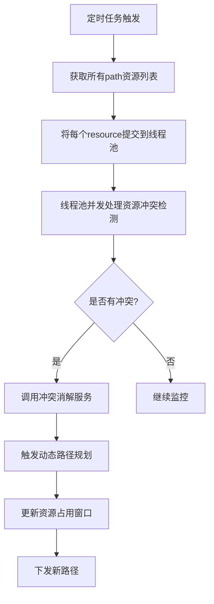
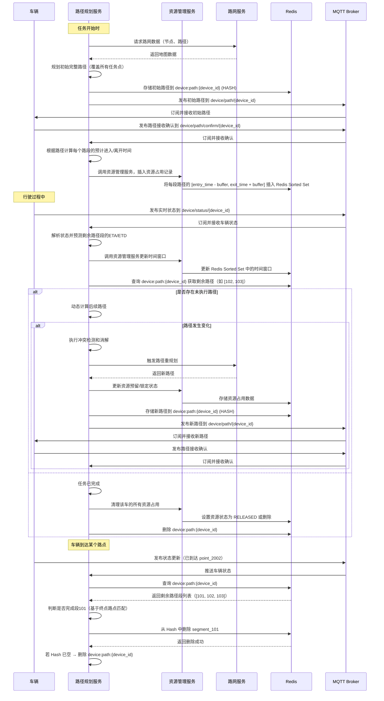

## 动态路径规划

  基于当前所有已分配任务的路径规划结果、机器人实时状态，预测未来一段时间内各个机器人对路段的占用时间窗口，如果发现时间窗口有冲突重新规划行驶路径。

### 预测方法
1. 时空轨迹预测: 对每个机器人，沿着其规划路径，逐段计算预计到达和离开每个关键资源点（如路径段入口/出口、交叉口内的所有节点）的时间 (ETA/ETD)。
2. 资源占用窗口生成: 为每个机器人计划占用的每个资源，生成一个预测的占用时间窗口：[预计进入时间 - 前置安全缓冲, 预计离开时间 + 后置安全缓冲]。缓冲时间用于吸收一定的执行不确定性。
3. 冲突预测与检测: 在一个共享的“资源-时间”视图中（例如，存储在Redis中的数据结构），检测不同机器人的预测资源占用窗口在时间和空间上的重叠。
resource_id -> sorted_list_of [(robot_id, predicted_entry_time, predicted_exit_time, priority, status), ...]

### 协调策略
1. 时间协调: 轻微延迟出发，让优先级较低或后规划的机器人在其起始点或某个安全的中间等待点（非关键路径）稍作等待，以错开与高优先级机器人在冲突点的相遇时间。
2. 速度协调: 建议机器人在非瓶颈路段提前减速或适当加速（在安全和能耗允许范围内），以调整其到达冲突点的时间。
3. 空间协调: 动态路径微调/重规划， 如果预测到严重或无法通过时间调整解决的冲突，提前为优先级较低或更具灵活性的机器人重新规划路径，选择避开预测拥堵区域的替代路线。
4. 优先级管理: 基于任务的紧急程度、机器人当前电量、已等待时间、任务链的重要性等因素，动态调整机器人在特定冲突点的通行优先级。
系统应能处理优先级反转问题（例如，通过优先级继承）。
5. 资源预留与锁定: 一旦冲突消解策略确定，系统会为机器人“预留”其在未来一段时间内将要使用的资源。当机器人即将实际进入该资源时，预留状态会转为“锁定/占用”。


## 业务流程图




## 交互时序图

开始执行任务时规划一个完整的路线，即经过所有任务点的完整路径，在行驶过程中根据当前路段动态计算后续行驶路径，如果有变化则下发新的行驶路径。



## 详细技术方案
### 行驶轨迹预测

- 输入：车辆当前状态（位置、速度）、任务路径。
- 逻辑：遍历任务路径中的每个 Path，基于车辆速度和路径长度，计算预计到达时间（ETA）和离开时间（ETD）。
为每个资源（Path、Point）生成时间窗口 [ETA - buffer, ETD + buffer]，buffer 默认 2s，吸收执行偏差。
将时间窗口存储到 Redis，key 为 resource:{map_name}:{resource_id}，value 为 Sorted Set，元素为 (vehicle_id, entry_time, exit_time, priority, status)。
- 输出：每个车辆的资源占用时间窗口。

### 资源占用检测
存储资源占用时间窗口：每当为车辆规划路径时，计算每个资源（路径段、节点）的预计占用时间窗口 [entry_time - buffer, exit_time + buffer]，buffer（默认 2 秒）用于吸收执行偏差。
将时间窗口存储到 Redis Sorted Set，key 为 resource:{map_name}:{resource_id}，score 为entry_time，value 为占用记录的 JSON 字符串。
- 查询资源占用：使用 ZRANGEBYSCORE 命令查询指定时间范围内的占用记录。若查询结果不为空，且时间窗口与目标时间段重叠，则资源被占用。
- 判断时间窗口重叠：对于资源占用记录 (entry_time1, exit_time1) 和目标时间窗口 (entry_time2, exit_time2)，如果满足以下条件之一，则存在重叠：entry_time1 <= exit_time2 且 exit_time1 >= entry_time2重叠表示资源在该时间段内被占用。
- 资源占用状态：如果查询到重叠的占用记录，且记录的 status 为 RESERVED 或 LOCKED，则资源被占用。如果没有重叠记录，或记录的 status 为 RELEASED，则资源未被占用。


### 轨迹冲突协调
在检测到时间窗口冲突时，使用时间协调和速度协调，防止车辆拥堵，有序通行。

- 时间协调：延长低优先级车辆的等待时间，优先保证高优先级车辆。
- 速度协调：动态调整速度（如减速），重新计算时间窗口。

### Redis缓存设计
#### 车辆路径缓存
使用hashset存储车辆规划路径，设计如下：
- key： device:path:{path_id}
- field :  {path_id}
- value:  JSONArray

#### 资源时间窗口缓存
使用Redis Sorted Set ，每个元素关联一个分数（score）。设计如下：
- key：resource:{map_name}:{resource_id}，表示特定地图中的某个资源（如路径段或节点）。
- value：存储资源占用记录，格式为 JSON 对象，包含 (vehicle_id, entry_time, exit_time, priority, status)。
- score：使用 entry_time（预计进入时间）作为分数，便于按时间排序和查询。用途：通过查询时间窗口的重叠，判断资源是否被占用。

### 具体示例
假设在地图map_1中，有一个路段resource_id=1001，两辆车device_1 和 device_2可能占用该路段。需要判断在时间 2025-05-27 11:40:00 到 2025-05-27 11:40:10 是否可以为 vehicle_3 分配该路径段。

#### Redis 数据结构
- Key：resource:map_warehouse:1001
- Sorted Set 内容：
	- 元素 1：{"device_id":"device_1 ","entry_time":"2025-05-27 11:39:50","exit_time":"2025-05-27 11:40:05","priority":10,"status":"RESERVED"}，score=1622027990（2025-05-27 11:39:50）。
	- 元素 2：{"device_id":"device_2","entry_time":"2025-05-27 11:40:08","exit_time":"2025-05-27 11:40:15","priority":8,"status":"RESERVED"}，score=1622028008（2025-05-27 11:40:08）。
#### 判断资源占用的步骤
1. 查询时间窗口：
	- 目标时间窗口为 [2025-05-27 11:40:00, 2025-05-27 11:40:10]   [1622028000, 1622028010]。
- 执行 Redis 命令：
	
	```bash
		ZRANGEBYSCORE resource:map_1:1001 1622028000 1622028010
	```
- 结果返回：
	- {"device_id":"device_1","entry_time":"2025-05-27 11:39:50","exit_time":"2025-05-27 11:40:05","priority":10,"status":"RESERVED"}
	- {"device_id":"device_2","entry_time":"2025-05-27 11:40:08","exit_time":"2025-05-27 11:40:15","priority":8,"status":"RESERVED"}

2. 检查时间窗口重叠：
	- 目标时间窗口：[1622028000, 1622028010]（11:40:00 - 11:40:10）。
	- 占用记录 1（device_1 ）：[1622027990, 1622028005]（11:39:50 - 11:40:05）。
		- 检查：1622027990 <= 1622028010 且 1622028005 >= 1622028000，重叠。
	- 占用记录 2（device_2）：[1622028008, 1622028015]（11:40:08 - 11:40:15）。
		- 检查：1622028008 <= 1622028010 且 1622028015 >= 1622028000，重叠。
	
3. 判断占用状态：
	- 两个记录的 status 均为 RESERVED，表示资源在目标时间段内被占用。
	- 结论：路径段 1001 在 [11:40:00, 11:40:10] 被 device_1 和 device_2占用，无法分配给 device_3。
	
4. 处理逻辑：
	
	为 device_3分配路径段，触发冲突消解：
	- 时间协调：延迟 device_3的出发时间到 11:40:15 之后。
	- 速度协调：调整 device_3的速度，避开冲突时间窗口。
	- 空间协调：为 device_3重新规划替代路径。

### 表结构设计

#### vehicle_dispatch_log (车辆调度日志表)

| 字段       | 名称     | 类型        | 说明                    |
| ---------- | -------- | ----------- | ----------------------|
| id         | 主键     | BIGINT      | 自增主键                |
| map_id     | 地图id    | BIGINT | 关联地图id |
| task_id    | 任务ID   | BIGINT      | 关联任务id              |
| device_id | 车辆ID | VARCHAR(30) | 车辆设备id |
| start_point_id   | 起始点ID | BIGINT      | 当前位置或起始路点    |
| target_point_id   | 目标点ID| BIGINT      | 需要到达的终点路点   |
| planned_detail    | 规划详情 |    JSON   | 下发给车端的数据 |
| path_version | 路径版本号 | INT | 从 1 开始递增，表示第几次变更 |
| replan_reason | 触发重规划的原因 | VARCHAR(100) |  |
| replan_trigger_time | 重新规划触发时间 | TIMESTAMP | 本次路径变更的触发时间 |
| path_send_time | 路径下发时间 | TIMESTAMP | 路径下发时间 |
| path_confirm_time | 车辆确认接收时间 | TIMESTAMP |  |
| status | 状态 | VARCHAR(30) | PLANNING, EXECUTING, COMPLETED, FAILED |
| create_time | 创建时间 | TIMESTAMP | 记录创建时间 |
| update_time | 更新时间 | TIMESTAMP | 记录最后更新时间 |


### 接口设计

| 接口名称 | 接口描述 | 输入 | 输出 |
|----------|------|------------|--------------|
| `refreshResourceTimeWindows` | 更新车辆对资源的预计占用时间窗 | 地图名、资源ID、车辆ID、任务ID、进入时间、离开时间、优先级 | 操作结果（成功/失败） |
| `predictTimeByPath` | 预测车辆按当前路径行驶各段的 预计达到 和 预计离开时间 | 车辆ID、路径段列表、当前状态 | 预计到达每个段的时间窗（entry_time, exit_time） |
| `detectResourceConflict` | 检测指定资源在未来一段时间内是否存在多个车辆的时间窗冲突 | 地图名、资源ID列表、时间窗口 | 冲突详情（车辆A/B、资源ID、时间窗重叠） |
| `queryResourceWindows` | 查询某个资源在指定时间段内的占用记录 | 地图名、资源ID、查询时间窗口 | 时间窗列表（车辆占用情况） |
| `replanPath` | 重新规划路径 | 车辆ID、任务ID、冲突信息、当前路径 | 新路径段列表、变更原因、新时间窗 |
| `publishNewPath` | 通过MQTT下发新路径至车端 | 车辆ID、新路径JSON、路径版本号 | MQTT消息发布结果 |
| `confirmPathReceived` | 接收车辆确认路径的消息，更新资源状态 | 车辆ID、路径版本号 | 确认结果、更新Redis缓存路径 |
| `removeCompletedPathSegments` | 移除已执行完毕的路径段 | 车辆ID、已完成的路段ID | 更新后的剩余路径段 |
| `releaseResourceOnExit` | 当车辆驶离某资源后释放其占用状态 | 地图名、资源ID、车辆ID | 资源状态更新（RELEASED） |
| `checkAllPathCompleted` | 检查 Redis 缓存路径中是否还有未执行段 | 车辆ID | 是否完成全部路径段（布尔值） |